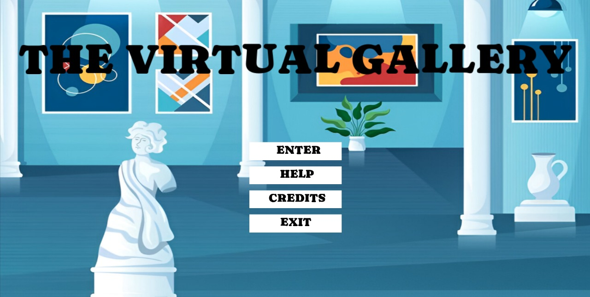
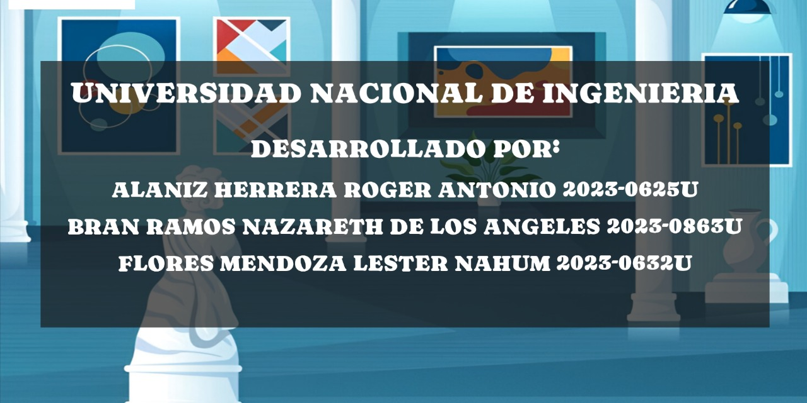
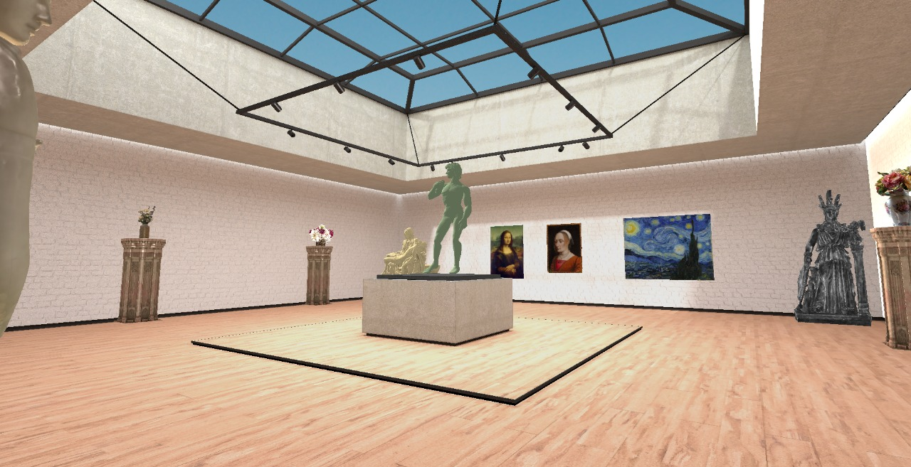
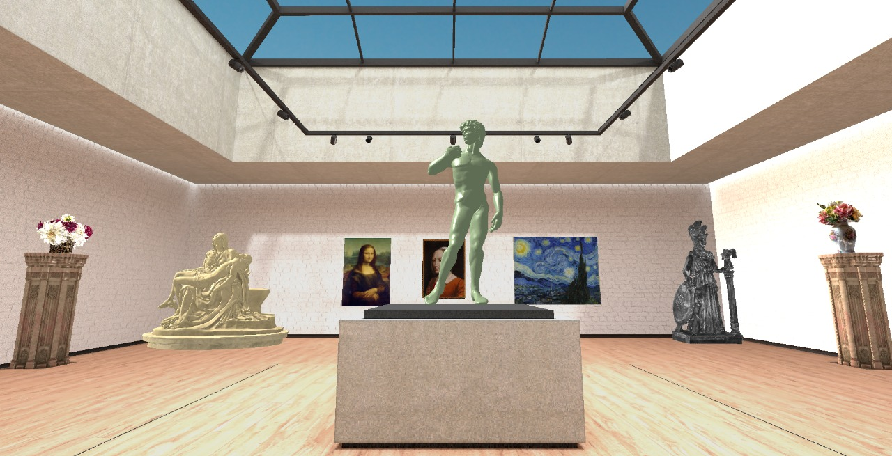
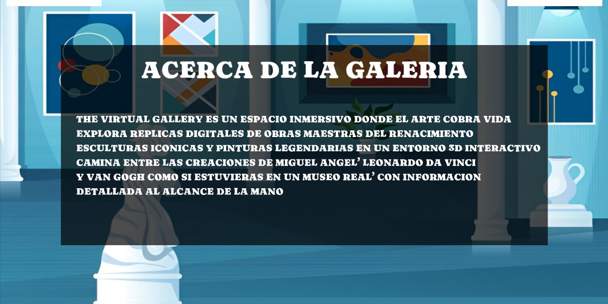

# The Virtual Art Gallery

## Description

This project is a **Virtual Museum** developed using **C++ and OpenGL** as a final assignment for the Computer Graphics course. The main objective is to provide an immersive experience where users can explore classical art sculptures and paintings in a 3D environment.


## License


[](https://choosealicense.com/licenses/mit/)

Distributed under the MIT License. See LICENSE.txt for more information.
## Movement

- "W": Go forward.
- "A": Move to the Left.
- "S": Go backards.
- "D": Move to the Right.
- "Shift": to move faster.
- "esc": to return to menu.

To **display** information about sculptures, **collide** with them.
## Libraries we used
This C++ project, developed with the OpenGL API, makes use of the following libraries:
- **GLAD**
- **GLFW**
- **GLM**
- **STB_IMAGE**
- **IRRKLANG**
- **FREETYPE**
- **JSON**
## Documentation

Final project document where the development of our project is explained in greater detail. [Documentation](Documentation/Documento%20final%20PG.pdf)

## Images

Here are some screenshots of the project showing the 3D environment, models, and interface:












## Demostrative Video

Watch a short video showcasing the virtual museum in action, including camera movement, model interaction, lighting, and sound effects:

https://youtu.be/Q_xHwAkFHZw?si=yTdBgC3zrLOv7y39


## Installation Guide

1. **Clone the Repository**

   Open your terminal or GitHub Desktop and run:

   ```bash
   git clone https://github.com/lesternfm22/Programacion-grafica-proyecto-final

2. **Open the Project in Visual Studio**
- Launch **Visual Studio 2022** or a compatible version.
- Open the file: **PG proyecto final.sln**.
3. **Build the Project**
- Select your preferred build configuration (e.g., Release | x64).
- Press **Ctrl + Shift + B** to build the project.
4. **Run the Application**
- Press **Ctrl + F5** to run the program without debugging.
- The 3D virtual museum environment should open.


## Authors

- [@Roalan21](https://www.github.com/Roalan21)
- [@nazarethbran](https://www.github.com/nazarethbran)
- [@lesternfm22](https://www.github.com/lesternfm22)

